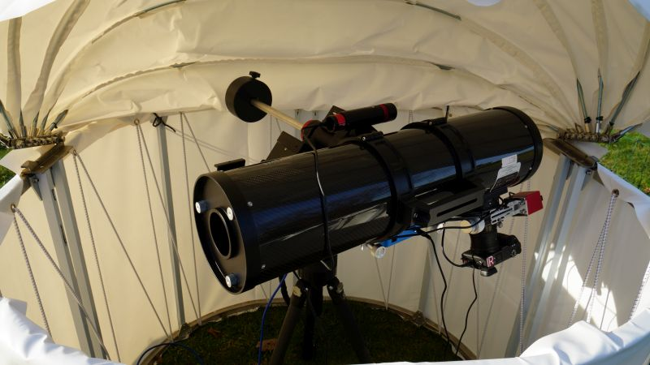
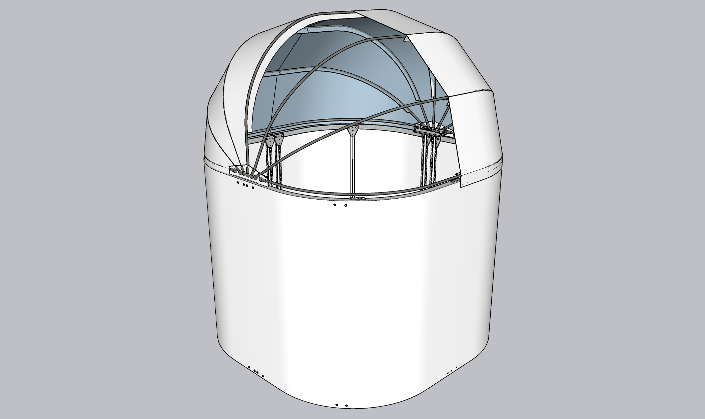
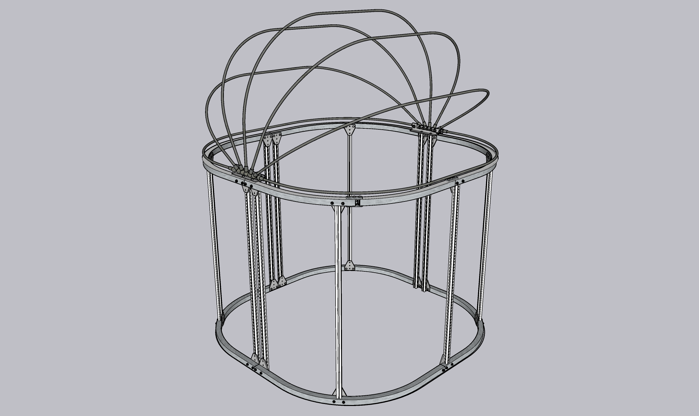
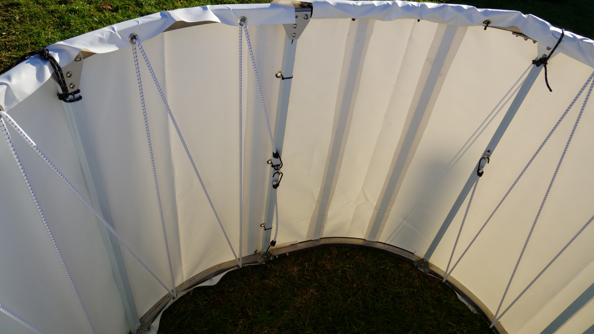
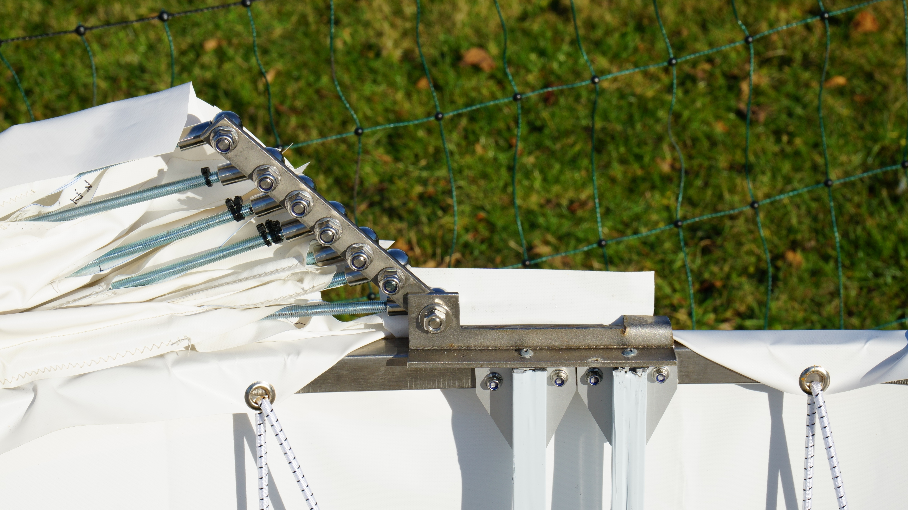
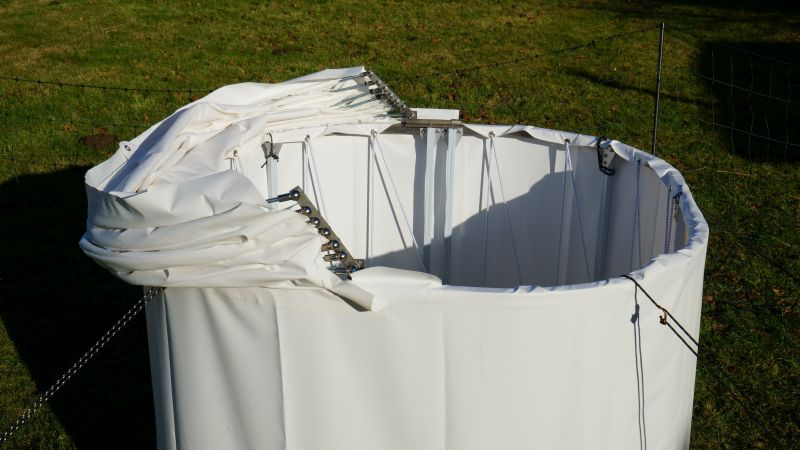
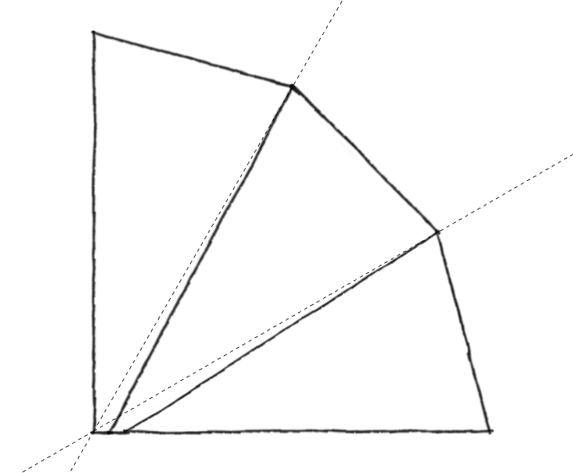

# dyi-tent-observatory

Lightweight diy tent observatory for my 6" astro telescope

## Beschreibung

Ein robustes Igluzelt, das leicht selbst gebaut werden kann und wind- und wasserdicht ist. Die Plane für das Faltdach wird selbst genäht, wofür eine robuste Nähmaschine erforderlich ist. Der Vorteil des Nähens (im Gegensatz zum Schweißen oder Kleben) ist, dass die Schlaufen für die Stützstangen leicht herzustellen sind. Die Rundungen der Grundform aus 25 mm Vierkantstahl wurden mit einer Biegemaschine hergestellt, aber natürlich sind auch eckige Formen möglich. Der Klappmechanismus des Daches ist ein Kompromiss, er ist einfach zu bauen (abgesehen vom Bohren der Löcher in den 5 mm Stahl) und ermöglicht das vollständige Absenken des Daches hinter den Rahmenhorizont. Es ist jedoch nicht von Vorteil, wenn das Öffnen und Schließen automatisiert werden soll.

Details der Konstruktion können der SketchUp-Datei entnommen werden.

## Basis

Damit das Dach später windschnittig ist, habe ich eine abgerundete Form gewählt, ganz rund konnte ich es nicht bauen, da ich 1m Vierkantprofile hatte und die Biegemaschine nicht bis zum Rand biegen kann. Die Vierkantprofile sind mit kurzen 20mm Vierkantprofilen ineinander gesteckt. Als Stützstreben verwende ich Aluprofile mit Nut, das ist stabil und die Befestigungen sind variabel. Die LKW-Plane wird am Ende wie bei einer Trommel darüber gespannt.

## Tür

Die Tür habe ich improvisiert, sie ist nur aus den oberen Vierkantprofilen ausgeschnitten. In die Plane habe ich Magnetstreifen zum Verschließen eingeklebt und unten einen Druckknopf, es hat sich herausgestellt das die Plane der Tür unten durch den Wind eingedrückt wird, deshalb habe ich noch 2 Alu-Flachprofile eingeklebt um die Plane steifer zu machen.

## Klappgelenk

Das Klappgelenk habe ich aus einem Stück Flachstahl und einem T-Profil gebaut. Dazu wird das T-Profil mit der Flex angepasst und ein Stück für die Auflage mit dem Hammer gebogen. Als Verbindung zu den Gewindestangen habe ich Winkelgelenke für Gasfedern in der Stärke der Gewindestangen genommen, was das Ganze sehr einfach macht. Die Löcher müssen weit genug auseinander sein, damit sich die Stangen bewegen können.

## Dach

Die Winkel der Dachträger sind so berechnet, dass ihr höchster Punkt dort liegt, wo er bei sternförmiger Anordnung der Stützen liegen würde. Da sie jedoch nicht den gleichen Ausgangspunkt haben, sind die Träger unterschiedlich lang und in verschiedenen Winkeln angeordnet. Das Schnittmuster für das Dach habe ich erstellt, indem ich die 3D-Oberfläche des Modells mit dem SketchUp-Plugin "Unwrap and Flutter Faces" zu einer ebenen Fläche verformt habe. Das PDF "Teil 1" zeigt also die Fläche zwischen dem Mittelpfosten und der nächsten Strebe von außen und muss zum Nähen einen entsprechenden Nähzugabe erhalten.

## Teileliste

### Nützliches Werkzeug

* Flex / Akkuschrauber / ...
* BOKA Biegemaschine TR-40
* Schneidpaste zum Bohren
* Sabacontact 70T PVC Kleber für Planen
* Leder-Nadeln Nadeldicke 120/19
* Teflonfuß/Gleitfuß Nähfuss
* CRAFTUS® Profi Ösenzange
* Sxdluzi Locher 10mm zum Vorlochen
* LIQUI MOLY Schraubensicherung
* Aussen-Entgrater für Ø 3-19 mm für die Gewindestangen

### Material

* 7 x Gewindestange M8 Länge 2m
* 14 x M8 Winkelgelenk 304 V2A (30mm)
* 1x T-Profil V2A 40 x 40 x 4 mm, 1m
* 1x Flachstahl V2A 20 x 5 mm, 0,5m
* 1x PVC-Plane 450g/m² - 3 m x 5 m
* 8 x Vierkantrohr V2A 25 x 25 x 2 mm, 1m
* 1 x Vierkantrohr V2A 20 x 20 x 2 mm, 1m
* 6 x Aluprofil 20x20 Nut6 Typ B, 6x2m
* 22 x Eckhalterungsverbindungsplatte T-Form
* 20m x Expanderseil 6mm
* 2 X Ringösenschrauben mit Außengewind
* 2 x Spiralhaken für ø 6mm Expanderseile
* M5x35 V2A Schrauben / Muttern
* A+B Magnetband2m für die Tür
* AMANN Nähgarn Serabond 30

**Summe:** ca. 1000€ (Inkl. 240€ Biegemaschien)
