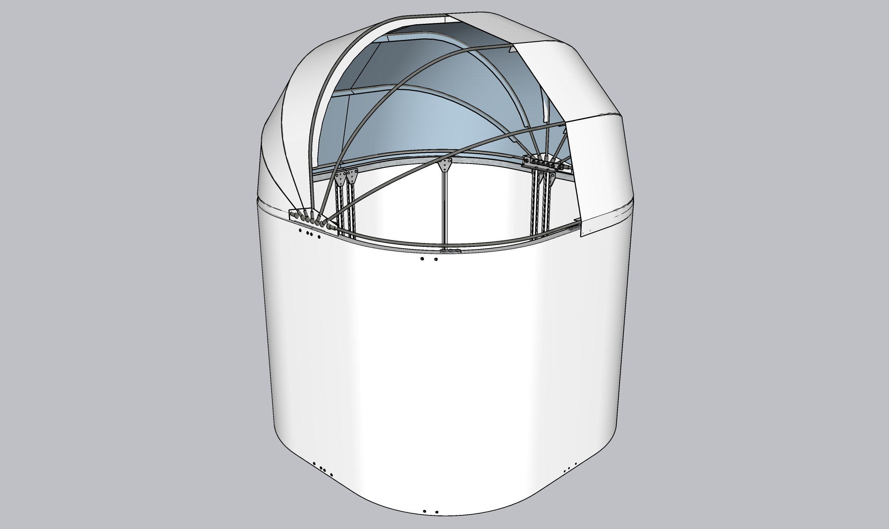
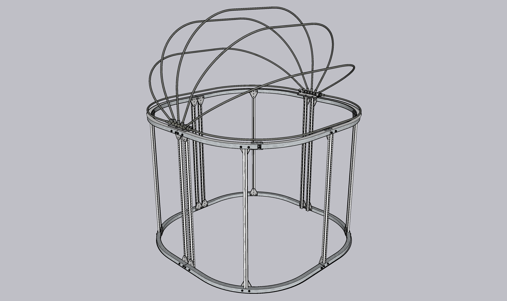
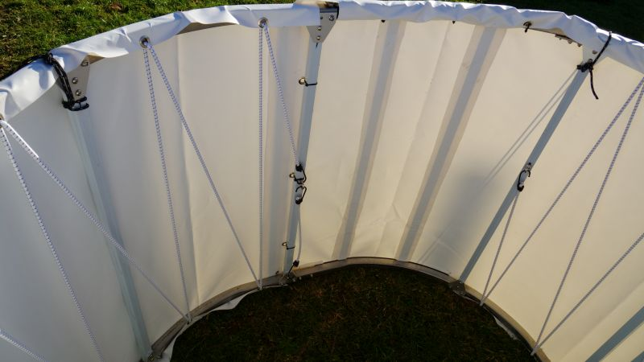
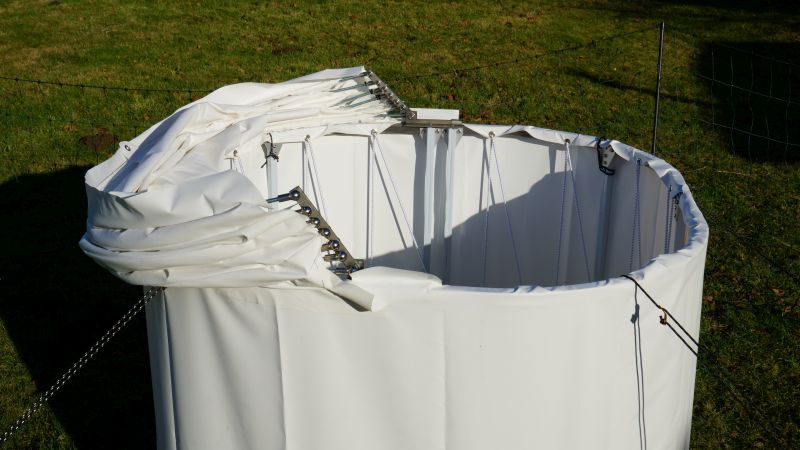

# dyi-tent-observatory

Lightweight diy tent observatory for my 6" astro telescope

## Description

A robust igloo tent that is easy to build yourself and is wind and waterproof. The tarpaulin for the folding roof is sewn by yourself, which requires a robust sewing machine. The advantage of sewing (as opposed to welding or gluing) is that the loops for the support poles are easy to make. The curves of the basic shape made of 25 mm square steel were produced using a bending machine, but of course angular shapes are also possible. The folding mechanism of the roof is a compromise, it is easy to build (apart from drilling the holes in the 5 mm steel) and allows the roof to be lowered completely behind the frame horizon. However, it is not an advantage if the opening and closing is to be automated.

Details of the construction can be found in the SketchUp file.

## Base

I chose a rounded shape so that the roof would later be streamlined. I couldn't build it completely round because I had 1 metre of square profiles and the bending machine can't bend right to the edge. The square profiles are interlocked with short 20mm square profiles. I use aluminium profiles with grooves as support struts, which are stable and the fastenings are variable. The lorry tarpaulin is stretched like a drum.

## Door

I improvised the door, it is only cut out of the upper square profiles. I glued magnetic strips into the tarpaulin to close it and a push button at the bottom. It turned out that the tarpaulin of the door is pressed in at the bottom by the wind, so I glued in 2 flat aluminium profiles to make the tarpaulin more rigid.

## Folding joint

I made the hinged joint from a piece of flat steel and a T-profile. To do this, the T-profile is adjusted with the angle grinder and a piece for the support is bent with a hammer. I used angle joints for gas springs in the same thickness as the threaded rods to connect them, which makes the whole thing very simple. The holes must be far enough apart to allow the rods to move.

## Roof

The angles of the roof beams are calculated so that their highest point is where it would be if the supports were arranged in a star shape. However, as they do not have the same starting point, the beams are different lengths and angles. I created the pattern for the roof by deforming the 3D surface of the model into a flat surface using the SketchUp plugin "Unwrap and Flutter Faces". The PDF "Part 1" therefore shows the surface between the centre post and the next strut from the outside and must be provided with an appropriate seam allowance for sewing.

